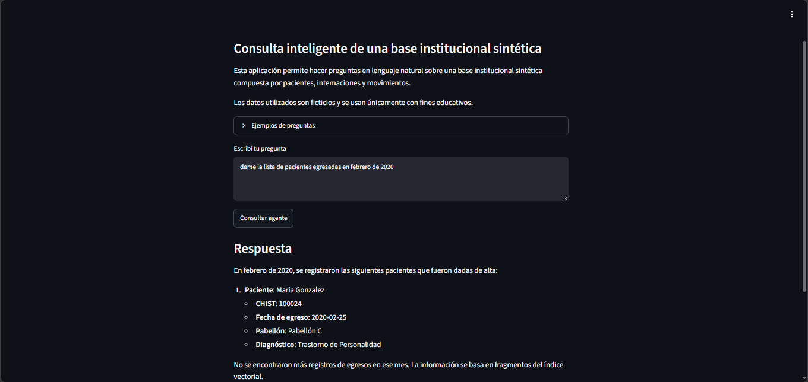

# Alura Agent Challenge — Consulta inteligente de base institucional sintética

Este proyecto implementa un agente de inteligencia artificial capaz de responder preguntas en lenguaje natural sobre una base institucional sintética compuesta por archivos CSV.

La solución fue desarrollada como parte del challenge final **Alura Agente — ONE IA for Tech**.

> **Importante:** todos los datos incluidos son ficticios y fueron generados únicamente con fines educativos. No contienen información real, personal, clínica ni sensible.

## Descripción del problema

En muchas organizaciones, la información administrativa queda distribuida en hojas de cálculo, sistemas heredados o documentos internos. Esto hace que las personas pierdan tiempo buscando datos, filtrando archivos o cruzando información manualmente.

El objetivo del proyecto es construir un agente de IA que permita consultar esa información en lenguaje natural, sin necesidad de abrir directamente los archivos originales.

## Solución propuesta

El proyecto utiliza una base sintética inspirada en una estructura administrativa migrada desde Microsoft Access a Google Sheets y exportada a CSV.

La aplicación permite hacer preguntas como:

- ¿Cuántas internaciones activas hay?
- ¿Qué diagnóstico aparece con mayor frecuencia?
- ¿Qué pabellón tuvo más movimientos?
- ¿Qué tipos de movimiento hay?
- Buscá registros relacionados con derivación.
- Mostrame el historial del CHIST 100000.

## Dataset utilizado

La base está compuesta por tres archivos CSV:

- `data/raw/pacientes.csv`
- `data/raw/internaciones.csv`
- `data/raw/movimientos.csv`

Relaciones principales:

- `pacientes.CHIST` → `internaciones.CHIST`
- `internaciones.ID_INTERNACION` → `movimientos.ID_INTERNACION`

## Arquitectura

CSV sintéticos  
↓  
Procesamiento con Pandas  
↓  
Limpieza y validación de relaciones  
↓  
Tabla enriquecida  
↓  
Conversión a documentos textuales  
↓  
Embeddings  
↓  
Indexación en Chroma  
↓  
Recuperación RAG  
↓  
Agente LangChain con herramientas  
↓  
Interfaz Streamlit  

## Etapas implementadas

### 1. Recolección y organización de documentos

Se definió como fuente una base sintética exportada a CSV desde Google Sheets.

Los documentos fueron organizados en tres categorías principales:

- Pacientes
- Internaciones
- Movimientos institucionales

La curaduría de calidad incluyó:

- uso exclusivo de datos ficticios;
- preservación de relaciones entre tablas;
- eliminación de datos sensibles;
- uso de archivos CSV como fuente inicial;
- organización del dataset en la carpeta `data/raw/`.

### 2. Procesamiento y extracción de contenido

El procesamiento se realiza con Python y Pandas.

Durante esta etapa se ejecutan las siguientes acciones:

- lectura de los CSV;
- normalización de columnas;
- limpieza de valores;
- conversión de fechas;
- validación de claves;
- cruce entre pacientes, internaciones y movimientos;
- generación de una tabla enriquecida;
- conversión de registros tabulares en texto estructurado.

Archivos generados:

- `data/processed/pacientes_procesados.csv`
- `data/processed/internaciones_procesadas.csv`
- `data/processed/movimientos_procesados.csv`
- `data/processed/movimientos_enriquecidos.csv`
- `data/processed/documentos_movimientos.jsonl`

### 3. Indexación

Los registros enriquecidos se convierten en documentos textuales. Luego se generan embeddings con un modelo multilingüe de `sentence-transformers` y se almacenan en una base vectorial Chroma.

La indexación permite realizar búsquedas por similitud semántica sobre los movimientos del dataset.

### 4. Recuperación RAG

La capa RAG transforma la pregunta del usuario en un embedding y recupera los fragmentos más relevantes desde Chroma.

El sistema devuelve fragmentos junto con sus metadatos, permitiendo que el agente utilice contexto recuperado para responder preguntas abiertas.

En esta versión MVP no se implementa reranking avanzado. La recuperación se realiza mediante similitud semántica top-k.

### 5. Agente de IA

El agente fue construido con LangChain y LangGraph.

No se entrenó ni fine-tuneó un modelo. El agente utiliza herramientas externas para consultar los datos.

Herramientas principales:

- `resumen_base`
- `contar_internaciones_activas`
- `diagnosticos_frecuentes`
- `movimientos_por_pabellon`
- `tipos_de_movimiento`
- `historial_por_chist`
- `buscar_en_documentos`

El agente combina dos estrategias:

- Preguntas estadísticas → herramientas Pandas
- Preguntas abiertas → recuperación RAG

## Tecnologías utilizadas

- Python
- Pandas
- LangChain
- LangGraph
- OpenRouter
- ChromaDB
- Sentence Transformers
- Streamlit
- Google Colab
- GitHub
- Oracle Cloud Infrastructure

## Estructura del repositorio

- `app.py`
- `README.md`
- `requirements.txt`
- `data/raw/`
- `data/processed/`
- `docs/`
- `notebooks/`
- `scripts/process_data.py`
- `screenshots/app_streamlit_funcionando.png`
- `src/`

## Ejecución en Google Colab

Instalar dependencias:

`!pip install -r requirements.txt`

Procesar los datos:

`!python scripts/process_data.py`

Crear el índice vectorial:

`from src.rag_retriever import crear_indice`

`print(crear_indice(recrear=True))`

Probar el agente:

`from src.alura_agent_final import preguntar_agente`

`print(preguntar_agente("Dame un resumen ejecutivo de la base"))`

## Ejecución de la aplicación Streamlit

Configurar la variable de entorno:

`export OPENROUTER_API_KEY="tu_api_key"`

Ejecutar la aplicación:

`streamlit run app.py --server.port 8501 --server.address 0.0.0.0`

## Captura de la aplicación

La aplicación fue probada localmente en Google Colab con Streamlit y expuesta temporalmente mediante Cloudflare Tunnel para validar su funcionamiento visual.

## Ejemplos de preguntas

- ¿Cuántas internaciones activas hay?
- ¿Qué diagnóstico aparece con mayor frecuencia?
- ¿Qué pabellón tuvo más movimientos?
- ¿Qué tipos de movimiento hay?
- Buscá registros relacionados con derivación.
- Mostrame el historial del CHIST 100000.

## Deploy en OCI

El despliegue final está previsto en Oracle Cloud Infrastructure mediante una instancia Compute.

Pasos generales:

1. Crear instancia Compute en OCI.
2. Clonar el repositorio desde GitHub.
3. Crear entorno virtual de Python.
4. Instalar dependencias.
5. Configurar `OPENROUTER_API_KEY`.
6. Procesar los datos.
7. Crear el índice vectorial.
8. Ejecutar Streamlit.
9. Abrir el puerto correspondiente.
10. Acceder a la aplicación desde el navegador.

Cuando el deploy esté completo, se agregará en esta sección el enlace o captura de la aplicación ejecutándose en OCI.

## Seguridad y privacidad

Este proyecto no utiliza datos reales. Todos los registros son sintéticos y fueron generados únicamente para fines educativos.

El agente trabaja en modo lectura y no modifica los archivos CSV originales.

## Estado del proyecto

MVP funcional:

- lectura de CSV;
- procesamiento con Pandas;
- validación de relaciones;
- generación de documentos;
- embeddings;
- indexación en Chroma;
- recuperación RAG;
- agente LangChain con herramientas;
- interfaz Streamlit.

## Mejoras futuras

- Deploy definitivo en OCI.
- Incorporar reranking.
- Agregar filtros por metadatos.
- Conectar directamente con Google Sheets.
- Mejorar trazabilidad de fuentes en la respuesta final.
- Agregar pruebas automatizadas.
