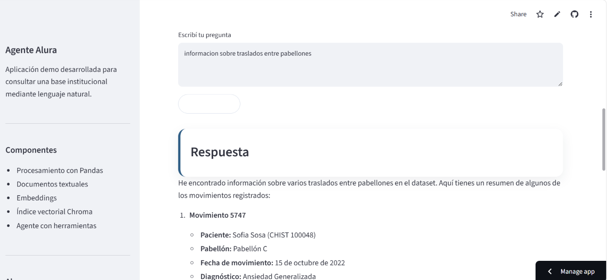

Alura Agent Challenge — Consulta inteligente de registros institucionales
Este proyecto implementa un agente de inteligencia artificial capaz de responder preguntas en lenguaje natural sobre una base institucional demo compuesta por archivos CSV.
La solución fue desarrollada como parte del challenge final Alura Agente — ONE IA for Tech.
> **Importante:** la base utilizada corresponde a un entorno de demostración. No contiene información real, personal, clínica ni sensible.
Demo online
La aplicación fue desplegada en Streamlit Community Cloud como alternativa cloud gratuita para validar el funcionamiento público del agente.
URL pública: https://agentealura2026.streamlit.app

Descripción del problema
En muchas organizaciones, la información administrativa queda distribuida en hojas de cálculo, sistemas heredados o documentos internos. Esto hace que las personas pierdan tiempo buscando datos, filtrando archivos o cruzando información manualmente.
El objetivo del proyecto es construir un agente de IA que permita consultar esa información en lenguaje natural, sin necesidad de abrir directamente los archivos originales.
Solución propuesta
El proyecto utiliza una base demo inspirada en una estructura administrativa migrada desde Microsoft Access a Google Sheets y exportada a CSV.
La aplicación permite hacer preguntas como:
¿Cuántas internaciones activas hay?
¿Qué diagnóstico aparece con mayor frecuencia?
¿Qué pabellón tuvo más movimientos?
¿Qué tipos de movimiento hay?
Buscá registros relacionados con derivación.
Mostrame el historial del CHIST 100000.
Mostrame información sobre traslados entre pabellones.
Dataset utilizado
La base está compuesta por tres archivos CSV:
`data/raw/pacientes.csv`
`data/raw/internaciones.csv`
`data/raw/movimientos.csv`
Relaciones principales:
`pacientes.CHIST` → `internaciones.CHIST`
`internaciones.ID_INTERNACION` → `movimientos.ID_INTERNACION`
Arquitectura
```text
CSV demo
↓
Procesamiento con Pandas
↓
Limpieza y validación de relaciones
↓
Tabla enriquecida
↓
Conversión a documentos textuales
↓
Embeddings
↓
Indexación en Chroma
↓
Recuperación RAG
↓
Agente LangChain con herramientas
↓
Interfaz Streamlit
↓
Deploy en Streamlit Community Cloud
```
Etapas implementadas
1. Recolección y organización de documentos
Se definió como fuente una base demo exportada a CSV desde Google Sheets.
Los documentos fueron organizados en tres categorías principales:
Pacientes
Internaciones
Movimientos institucionales
La curaduría de calidad incluyó:
uso exclusivo de datos de demostración;
preservación de relaciones entre tablas;
eliminación de datos sensibles;
uso de archivos CSV como fuente inicial;
organización del dataset en la carpeta `data/raw/`.
2. Procesamiento y extracción de contenido
El procesamiento se realiza con Python y Pandas.
Durante esta etapa se ejecutan las siguientes acciones:
lectura de los CSV;
normalización de columnas;
limpieza de valores;
conversión de fechas;
validación de claves;
cruce entre pacientes, internaciones y movimientos;
generación de una tabla enriquecida;
conversión de registros tabulares en texto estructurado.
Archivos generados:
`data/processed/pacientes_procesados.csv`
`data/processed/internaciones_procesadas.csv`
`data/processed/movimientos_procesados.csv`
`data/processed/movimientos_enriquecidos.csv`
`data/processed/documentos_movimientos.jsonl`
3. Indexación
Los registros enriquecidos se convierten en documentos textuales. Luego se generan embeddings con un modelo multilingüe de `sentence-transformers` y se almacenan en una base vectorial Chroma.
La indexación permite realizar búsquedas por similitud semántica sobre los movimientos del dataset.
4. Recuperación RAG
La capa RAG transforma la pregunta del usuario en un embedding y recupera los fragmentos más relevantes desde Chroma.
El sistema devuelve fragmentos junto con sus metadatos, permitiendo que el agente utilice contexto recuperado para responder preguntas abiertas.
En esta versión MVP no se implementa reranking avanzado. La recuperación se realiza mediante similitud semántica top-k.
5. Agente de IA
El agente fue construido con LangChain y LangGraph.
No se entrenó ni fine-tuneó un modelo. El agente utiliza herramientas externas para consultar los datos.
Herramientas principales:
`resumen_base`
`contar_internaciones_activas`
`diagnosticos_frecuentes`
`movimientos_por_pabellon`
`tipos_de_movimiento`
`historial_por_chist`
`buscar_en_documentos`
El agente combina dos estrategias:
Preguntas estadísticas → herramientas Pandas
Preguntas abiertas → recuperación RAG
Tecnologías utilizadas
Python
Pandas
LangChain
LangGraph
OpenRouter
ChromaDB
Sentence Transformers
Streamlit
Streamlit Community Cloud
Google Colab
GitHub
Estructura del repositorio
```text
.
├── app.py
├── README.md
├── requirements.txt
├── data/
│   ├── raw/
│   └── processed/
├── docs/
├── notebooks/
├── scripts/
│   └── process_data.py
├── screenshots/
│   └── app_streamlit_cloud_funcionando_recortada.png
└── src/
```
Ejecución en Google Colab
Clonar el repositorio:
```python
!git clone https://github.com/isabellor/AgenteAlura.git
%cd AgenteAlura
```
Instalar dependencias:
```python
!pip install -r requirements.txt
```
Procesar los datos:
```python
!python scripts/process_data.py
```
Crear el índice vectorial:
```python
from src.rag_retriever import crear_indice

print(crear_indice(recrear=True))
```
Probar el agente:
```python
from src.alura_agent_final import preguntar_agente

print(preguntar_agente("Dame un resumen ejecutivo de la base"))
```
Ejecución local de la aplicación Streamlit
Configurar la variable de entorno:
```bash
export OPENROUTER_API_KEY="tu_api_key"
```
Ejecutar la aplicación:
```bash
streamlit run app.py --server.port 8501 --server.address 0.0.0.0
```
Deploy
La aplicación fue desplegada en Streamlit Community Cloud conectando el repositorio de GitHub con la plataforma.
Configuración utilizada:
Repositorio: `isabellor/AgenteAlura`
Rama: `main`
Archivo principal: `app.py`
Variable secreta: `OPENROUTER_API_KEY`
URL pública: https://agentealura2026.streamlit.app
El challenge sugería OCI Compute como plataforma de despliegue. Para esta entrega se utilizó Streamlit Community Cloud como alternativa cloud gratuita y adecuada para aplicaciones Streamlit, manteniendo el objetivo de publicar la aplicación en una URL accesible públicamente.
Seguridad y privacidad
Este proyecto no utiliza datos reales. Todos los registros corresponden a un entorno demo y fueron generados únicamente para fines educativos.
El agente trabaja en modo lectura y no modifica los archivos CSV originales.
La clave de OpenRouter no se guarda en el repositorio. En el despliegue se configura como secreto mediante la sección Secrets de Streamlit Community Cloud.
Estado del proyecto
MVP funcional:
lectura de CSV;
procesamiento con Pandas;
validación de relaciones;
generación de documentos;
embeddings;
indexación en Chroma;
recuperación RAG;
agente LangChain con herramientas;
interfaz Streamlit;
deploy público en Streamlit Community Cloud.
Mejoras futuras
Incorporar reranking.
Agregar filtros por metadatos.
Conectar directamente con Google Sheets.
Mejorar trazabilidad de fuentes en la respuesta final.
Agregar pruebas automatizadas.
Evaluar despliegue adicional en OCI Compute.
